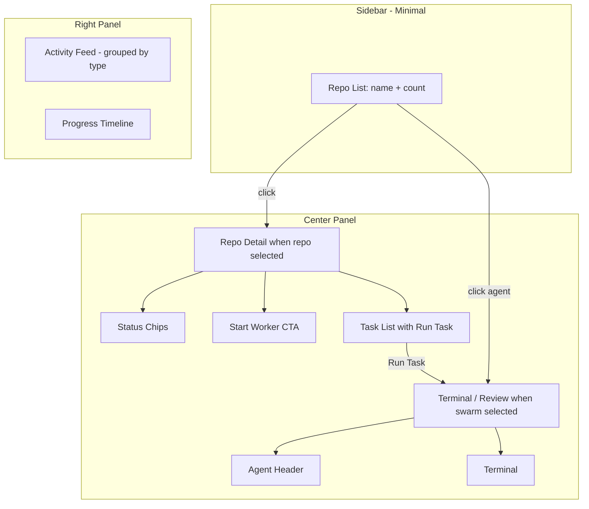

# Hub Dashboard UX Improvement Plan

This plan implements the 12 improvement areas, ordered by impact and dependency. The goal is to make the UI **guide users** instead of requiring interpretation.

---

## Phase 1: Sidebar Simplification (Highest Impact)

**Goal**: Make repos the primary object. Collapse branch, workers, and status into the center panel.

### Current State

`[Sidebar.jsx](hub/dashboard/src/components/Sidebar.jsx)` shows per-repo: name, branch (on hover), Start worker button, DONE/FAILED/RUNNING groups, nested agent rows.

### Target State

Sidebar shows only:

```
Marketing        ● 14
Website          ● 0
Electron         ● 3
Hub              ● 9
```

- Repo name + identity dot + open task count
- Optional: small status indicator (dot) if repo has running/review workers
- Click selects repo; center shows full detail

### Implementation

- Strip Sidebar to repo list only: remove `Start worker` button, remove nested worker/status groups
- Move `onStartWorker` to center panel (Repo Detail)
- Keep `onSelect` for repo and swarm; when user selects a swarm agent (from center), selection stays swarm
- **New**: Repo Detail is the center content when `selection.type === 'repo'` — this is the current TaskBoard, but we will add a header section (see Phase 2)

### Files

- `[Sidebar.jsx](hub/dashboard/src/components/Sidebar.jsx)`: Simplify to flat repo list
- `[App.jsx](hub/dashboard/src/App.jsx)`: Ensure swarm agents are selectable from center (TaskBoard already has `onOpenBee` for "View" on running tasks)

**Open question**: Where do users select a swarm agent from? Currently they click agent rows in the Sidebar. If we remove those, we need another place — e.g. a "Workers" section in the center Repo Detail, or a list of active agents in the header. **Recommendation**: Add a compact "Active Workers" strip in the center (below repo header) when a repo has workers; clicking one selects that agent and switches to swarm view.

---

## Phase 2: Repo Detail Panel + Primary Action

**Goal**: When a repo is selected, show a clear Repo Detail with stats, primary action, and tasks.

### Layout (inside TaskBoard / new RepoDetail)

```
Marketing
────────────
● 14 Open    ✓ 1 Completed    ✕ 1 Failed

[ + Start Worker ]   (primary, prominent)

Open Tasks
──────────
• Task 1
• Task 2
...
```

### Implementation

- Add a **header block** at top of TaskBoard (or new `RepoDetail.jsx`): Open count, Completed count, Failed count as **strong status chips** (colored badges)
- Add **primary CTA**: `[ + Start Worker ]` — prominent button (primary color, icon, above task list)
- Status chips: use `--status-active` (green) for Open, `--status-complete` for Completed, `--status-failed` (red, high contrast) for Failed
- Move "Start worker" from Sidebar into this header

### Files

- `[TaskBoard.jsx](hub/dashboard/src/components/TaskBoard.jsx)`: Add header block with status chips + Start Worker
- `[App.jsx](hub/dashboard/src/App.jsx)`: Pass `onStartWorker` to TaskBoard when showing repo view (or derive from `selectedRepo`)

---

## Phase 3: Task Readability + Run Task Affordance

**Goal**: Structure tasks visually; make "Run Task" the obvious action per task.

### Task Structure (client-side parsing)

Tasks are plain text. We can **heuristically parse** common patterns:

- First line or first sentence = title
- Lines starting with `Criteria:`, `Files:`, `—` = structured blocks
- Or: truncate long tasks to first line as title, show full text in expand/collapse

### Implementation

- **Title**: Use first line (or first ~80 chars) as display title; truncate with ellipsis
- **Expand**: Add "Show more" / chevron to expand full task text
- **Run Task button**: Prominent `[ ▶ Run Task ]` on each task row — primary color, icon, always visible (not just on hover)
- Optional: If task text contains `Criteria:` or `Files:`, split into sections (simple regex)

### Files

- `[TaskBoard.jsx](hub/dashboard/src/components/TaskBoard.jsx)`: Refactor task row layout; add expand/collapse; make Run Task button dominant

---

## Phase 4: Status Visibility

**Goal**: Failures and completions should pop visually.

### Implementation

- **Status chips** in Repo Detail header: `● 14 Open` (neutral/muted), `✓ 1 Completed` (green), `✕ 1 Failed` (red, bold)
- **Sidebar**: If repo has failed workers, show red dot or small badge
- **Activity feed** (Phase 7): Use strong status icons

### Files

- `[TaskBoard.jsx](hub/dashboard/src/components/TaskBoard.jsx)`: Status chips in header
- `[Sidebar.jsx](hub/dashboard/src/components/Sidebar.jsx)`: Optional failed-count indicator on repo row

---

## Phase 5: Terminal Agent Header

**Goal**: Add narrative context above the terminal so users know what is happening.

### Layout

```
Worker: Marketing Agent
Task: Add placeholder screenshot for video

Status: Running
Step: Editing components/sections/screenshot-feature.tsx

[ Terminal output below ]
```

### Data Sources

- `taskInfo` (from `agentTerminals`): `taskText`, `repoName`
- Swarm detail: `GET /api/swarm/:id` for `progressEntries` (last entry = current step)
- Need to poll swarm when `swarmFileId` is available, or pass `progressEntries` from parent

### Implementation

- Add `AgentHeader` component above terminal in `TerminalPanel` / `TerminalInstance`
- Props: `taskText`, `repoName`, `status` (from swarm or derived), `currentStep` (last progress entry)
- Fetch swarm detail when `swarmFileId` is known; use `progressEntries[progressEntries.length - 1]` as current step
- Poll every 5–8s to keep step updated

### Files

- `[TerminalPanel.jsx](hub/dashboard/src/components/TerminalPanel.jsx)`: Add AgentHeader; fetch swarm detail for active session
- New: `AgentHeader.jsx` (or inline in TerminalPanel)

---

## Phase 6: Results Panel Hierarchy

**Goal**: Structure results with clear sections (File Edited, Changes, Reason).

### Current State

Results are raw markdown from swarm file. No structured parsing.

### Implementation

- **Parse results** client-side: Look for patterns like `File edited:`, `What changed`, `Reason`, or `##` headers
- Or: Add optional structure in `parsers.js` — parse `## Results` into subsections if they exist
- **Layout**: Use distinct blocks — "File Edited" (monospace path), "Changes" (bullet list), "Reason" (paragraph)
- If no structure, keep current markdown render but add a "Result Summary" heading and improve spacing

### Files

- `[ResultsPanel.jsx](hub/dashboard/src/components/ResultsPanel.jsx)`: Add structured layout; optionally parse `detail.results` for File/Changes/Reason
- `[parsers.js](hub/parsers.js)` (optional): Extend to return structured `resultsSections` if we add conventions to swarm file format

---

## Phase 7: Activity Feed Grouping by Type

**Goal**: Group activity by event type (Task Completed, Worker Started, Worker Failed).

### Current State

`[/api/activity](hub/dashboard/server.js)` returns `{ entries: [{ date, bullet, repo }] }`. No event type.

### Implementation

- **Heuristic**: Infer type from bullet text — e.g. "Task completed", "Worker started", "failed", "Marked as done"
- **Backend option**: Extend activity log format to include type (e.g. `- [completed] Task X`) — would require `parseActivityLog` and activity-log write logic changes
- **Client-side**: Map bullets to types via regex; render with icons (✓ Task Completed, ⚙ Worker Started, ✕ Worker Failed)
- Group by date, then by type within date

### Files

- `[RightPanel.jsx](hub/dashboard/src/components/RightPanel.jsx)`: ActivityFeed — add type inference, group by type, use strong icons
- `[parsers.js](hub/parsers.js)` (optional): Add `type` to entries if we extend format

---

## Phase 8: Empty States

**Goal**: Teach users what to do next when there is no content.

### Implementation

- **No tasks**: "No tasks yet. [ + Add Task ]" with prominent button
- **No workers**: "No workers running. [ + Start Worker ] to begin."
- **No activity**: "No activity yet. Complete a task to see it here."
- Use existing empty-state pattern (icon + message); add CTA button

### Files

- `[TaskBoard.jsx](hub/dashboard/src/components/TaskBoard.jsx)`: Empty state with Add Task CTA
- `[RightPanel.jsx](hub/dashboard/src/components/RightPanel.jsx)`: ActivityFeed empty state with Start Worker hint
- `[TerminalPanel.jsx](hub/dashboard/src/components/TerminalPanel.jsx)`: Refine "No terminal" empty state

---

## Phase 9: Search

**Goal**: Search across tasks, repos, and agents.

### Implementation

- **Client-side search**: Filter `overview.repos` (tasks from `repo.tasks.sections`), `swarm.agents`, and optionally activity
- **UI**: Search input in HeaderBar or Sidebar; Cmd+K could open command palette (Phase 10) which includes search
- **Scope**: Tasks (text), Repos (name), Agents (task name, id)
- **Results**: Navigate to matching repo/task/agent on select

### Files

- New: `lib/useSearch.js` — hook that filters overview + swarm by query
- `[HeaderBar.jsx](hub/dashboard/src/components/HeaderBar.jsx)`: Add search input, or integrate with CommandPalette
- New: `SearchResults.jsx` or inline in CommandPalette

---

## Phase 10: Command Palette (Cmd+K)

**Goal**: Power users can run actions via keyboard.

### Implementation

- **Trigger**: `useEffect` with `keydown` listener for `Meta+K` (Mac) / `Ctrl+K`
- **Modal**: Overlay with input; filter commands by query
- **Commands**: Start worker, Create task, Switch repo, Kill worker, Open terminal, Search (navigate)
- **Execution**: Call existing handlers (`handleStartWorker`, `handleStartTask`, `setSelection`, etc.)

### Files

- New: `components/CommandPalette.jsx` — modal, input, command list, keyboard nav
- `[App.jsx](hub/dashboard/src/App.jsx)`: Render CommandPalette; pass handlers; register Cmd+K

---

## Phase 11: Visual Density

**Goal**: Improve readability with more breathing room.

### Implementation

- Increase `line-height` for task text (e.g. `leading-relaxed` → `leading-loose` where appropriate)
- Increase card padding (`p-4` → `p-5` for main cards)
- Increase vertical spacing between task rows (`space-y-2` → `space-y-3`)

### Files

- `[theme.css](hub/dashboard/src/styles/theme.css)`: Optional base line-height
- `[TaskBoard.jsx](hub/dashboard/src/components/TaskBoard.jsx)`: Padding, spacing
- `[ResultsPanel.jsx](hub/dashboard/src/components/ResultsPanel.jsx)`: Spacing

---

## Phase 12: Micro-Interactions

**Goal**: Subtle motion for perceived quality.

### Implementation

- **Task expand**: `animate-fade-up` or slide when expanding task details
- **Worker start**: Brief pulse or highlight when new worker appears
- **Running status**: Existing `animate-pulse-soft` or `animate-ping-slow` — ensure it's visible
- **Activity updates**: `animate-slide-in` when new activity appears (if we add real-time or optimistic updates)

### Files

- `[theme.css](hub/dashboard/src/styles/theme.css)`: Ensure animations exist
- `[TaskBoard.jsx](hub/dashboard/src/components/TaskBoard.jsx)`: Expand animation
- `[RightPanel.jsx](hub/dashboard/src/components/RightPanel.jsx)`: Activity item animation

---

## Architecture Summary




---

## Implementation Order


| Phase | Scope                        | Dependencies                   |
| ----- | ---------------------------- | ------------------------------ |
| 1     | Sidebar simplification       | None                           |
| 2     | Repo Detail + primary action | Phase 1                        |
| 3     | Task readability + Run Task  | Phase 2                        |
| 4     | Status visibility            | Phase 2                        |
| 5     | Terminal agent header        | None                           |
| 6     | Results panel hierarchy      | None                           |
| 7     | Activity feed grouping       | None                           |
| 8     | Empty states                 | Phases 1–2                     |
| 9     | Search                       | None                           |
| 10    | Command palette              | Phase 9 (optional integration) |
| 11    | Visual density               | None                           |
| 12    | Micro-interactions           | Phases 2–3                     |


---

## Key Decisions to Confirm

1. **Swarm agent selection**: After removing agent list from Sidebar, where do users click to open a worker? Options: (A) "Active Workers" strip in Repo Detail, (B) Keep minimal agent list in Sidebar (collapsed by default), (C) Only via "View" on running task in TaskBoard.
2. **Task structure**: Should we add a convention to todo.md for Criteria/Files (e.g. `---\nCriteria:\n- ...`) or keep client-side heuristic parsing only?
3. **Activity type**: Use heuristic from bullet text, or extend activity-log format and parsers?

